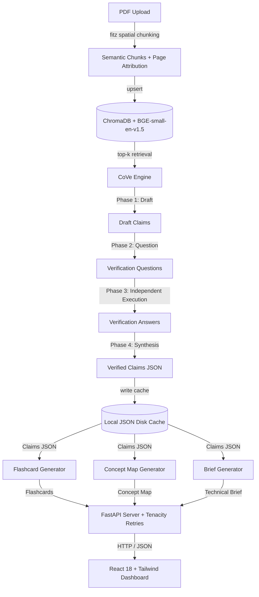

# EPISTEME: The Self-Verifying, Hallucination-Free Research Engine

> **EPISTEME** is a production-grade AI academic research companion designed to eliminate factual hallucinations, accelerate scientific literature reviews, and combat cognitive fatigue when reading dense research papers.

Built during a 24-hour hackathon, EPISTEME decomposes complex academic papers into interactive, verifiable, and visually searchable concept topologies.

---

## 🎯 The Problem

1. **RAG Hallucinations**: Standard Retrieval-Augmented Generation (RAG) models frequently hallucinate facts or conflate page sources, leading to incorrect references in scientific work.
2. **Dense Summarization Fatigue**: Generic text summaries over-compress technical details, stripping out critical mathematical proofs, dataset limitations, and methodology nuances.
3. **Memory Decay**: Academic readers struggle to retain key insights without active recall mechanisms or structural entity mapping across long documents.

---

## 💡 The Solution

- **Chain-of-Verification (CoVe) Engine**: A 4-phase verification process using `gemini-2.0-flash` that drafts claims, formulates independent verification questions, answers them from raw source chunks, and filters out unverified statements.
- **Explicit Factual Grounding & Citation Cards**: Clickable, hover-glowing references (`Source: Page 4-5`) that link claims, limitations, and Q&A answers directly to verbatim source quotes.
- **Spatial Knowledge Topology**: Interactive 2D force-directed node-link graph visualizing entities, algorithms, datasets, and relationships extracted from the paper.
- **Derived Active Recall Deck**: Lightweight spaced repetition (FSRS) flashcard review queue allowing researchers to grade recall difficulty (*Hard*, *Good*, *Easy*) directly in the UI.
- **Transparent Failure Resilience**: Transparent UI fallback detection. If API limits trigger, EPISTEME never fails silently—it alerts the user via a top banner and serves verified cached demo data.

---

## 🏗️ Technical Architecture (24-Hour Build vs. Target Vision)

To guarantee **100% demo uptime and sub-second retrieval** during a strict 24-hour hackathon, we made deliberate architectural trade-offs:



### Architectural Reconciliation

| System Component | Shipped 24-Hour Hackathon MVP | Target Vision (V2 Production Roadmap) |
| :--- | :--- | :--- |
| **Vector Database** | Local embedded **ChromaDB** (`PersistentClient`) | Distributed Neo4j Graph RAG Cluster |
| **Embedding Model** | `BAAI/bge-small-en-v1.5` (Warmed up in RAM on startup) | Fine-Tuned Domain Embedding Model |
| **PDF Extraction** | PyMuPDF (`fitz`) block & sentence parser with multi-page bounds | GPU-accelerated Nemotron-Parse Vision Pipeline |
| **LLM Core** | Google `gemini-2.0-flash` with `tenacity` retries | Fine-tuned open weights model ensemble |
| **Spaced Repetition** | Client-Side React State FSRS Algorithm | Remote Anki / FSRS Server API Sync |
| **Task Execution** | Async FastAPI + Local File Cache | Distributed Celery + RabbitMQ Workers |

---

## 🛠️ Tech Stack

* **Backend**: Python 3.10+, FastAPI, ChromaDB, Sentence-Transformers (`BAAI/bge-small-en-v1.5`), PyMuPDF (`fitz`), `tenacity` (retry resilience), `google-genai` SDK (`gemini-2.0-flash`).
* **Frontend**: React 18+, TypeScript, Tailwind CSS, Vite, Lucide React Icons, `react-force-graph-2d` (HTML5 Canvas visualization).

---

## ⚡ Quick Start & Installation

### 1. Prerequisites
Ensure you have **Python 3.10+** and **Node.js 18+** installed.

### 2. Set Up the Backend
Clone the repository and install the Python dependencies:
```bash
# Install Python packages
pip install fastapi uvicorn pydantic pymupdf sentence-transformers chromadb requests google-genai tenacity aiofiles
```

Create a `.env` file in the root directory:
```bash
echo "GEMINI_API_KEY=your-actual-gemini-api-key" > .env
```
*(Note: If no API key is specified, the server gracefully serves offline cached demo data with a top UI warning banner).*

### 3. Set Up the Frontend
Navigate into the `frontend` directory and install the Node modules:
```bash
cd frontend
npm install
cd ..
```

### 4. Boot the Application (One-Click)
Run both backend and frontend concurrently using the provided shell script:
```bash
chmod +x run.sh
./run.sh
```

Alternatively, run them in separate terminals:
- **Backend**: `uvicorn main:app --reload --port 8000` (Runs at `http://localhost:8000`)
- **Frontend**: `cd frontend && npm run dev` (Runs at `http://localhost:5173`)

---

## 🧪 System Health & Pre-Demo Verification

We provide an automated sanity checker script to test system integration before stage presentation:
```bash
python test_sanity.py
```
A successful test run outputs:
```text
============================================================
EPISTEME Backend Sanity Checklist
============================================================
[PASS] - FastAPI Health Check (/) 
[PASS] - Upload Ingestion (/upload) [ID: 3a9f1b-...]
[PASS] - Metadata Extraction (/paper/{id}/metadata)
[PASS] - CoVe Claims Verification (/paper/{id}/claims)
[PASS] - Grounding Q&A Engine (/paper/{id}/ask)
============================================================
```

---

## 👥 Engineering Team

- **Lead AI & Backend Architect**: *[Team Member 1]* - CoVe Engine, Vector Store, LLM Retries
- **Full-Stack Systems Engineer**: *[Team Member 2]* - FastAPI Server, Caching & Route Hardening
- **Frontend & UI Architect**: *[Team Member 3]* - React Shell, 2D Graph Canvas, Citation Cards & FSRS Deck
