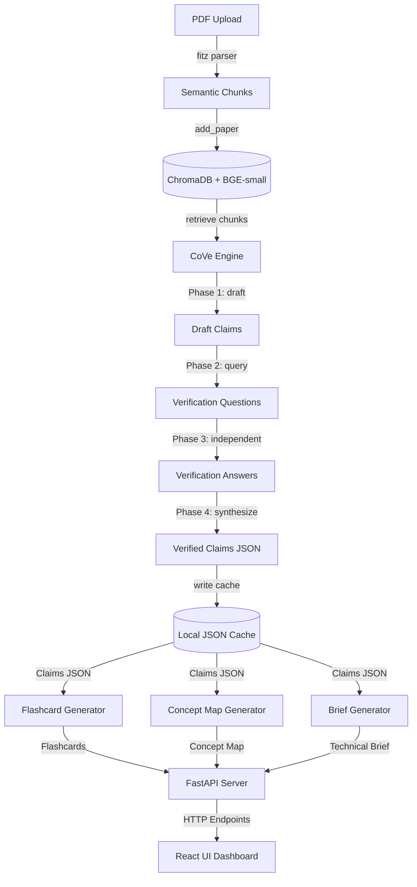

# EPISTEME: The Antigravity, Self-Verifying Research Engine

**EPISTEME** is an AI-powered academic research companion designed to eliminate factual hallucinations, accelerate literature reviews, and combat cognitive fatigue when reading dense scientific papers.

Built during a strict 24-hour hackathon environment utilizing an "antigravity" parallel workflow, EPISTEME decomposes complex academic texts into interactive, verifiable, and visually searchable concept topologies.

---

## The Problem
1. **RAG Hallucinations**: Standard Retrieval-Augmented Generation (RAG) models frequently hallucinate facts or conflate page sources, leading to incorrect references.
2. **Dense Summarization Fatigue**: General summaries compress too much information, dropping mathematical definitions and edge-case limitations.
3. **Memory Decay**: Readers struggle to retain key insights without active recall mechanisms or structural entity mapping.

---

## The Solution
- **Chain-of-Verification (CoVe) Engine**: A 4-phase verification process using `gemini-2.0-flash` that drafts claims, generates verification questions, answers them independently from raw source chunks, and filters out unverified statements.
- **Explicit Grounding & Citation Cards**: Clickable, hover-glowing references that link claims and answers directly to page-specific verbatim quotes.
- **Spatial Knowledge Graph**: Interactive force-directed node-link layouts highlighting relationships between theoretical concepts in the text.
- **Derived Artifact Pipeline**: Structured creation of active recall flip-flashcards, technical briefs, and executive summaries from verified factual claims.

---

## Technical Architecture



---

## Tech Stack
*   **Backend**: Python 3.10+, FastAPI (Endpoints & Routing), ChromaDB (Vector Store), Sentence-Transformers (`BAAI/bge-small-en-v1.5`), PyMuPDF (fitz), google-genai SDK (`gemini-2.0-flash`).
*   **Frontend**: React 18+, TypeScript, Tailwind CSS v4, Vite (Fast Bundler), `react-force-graph-2d` (HTML5 Canvas visualization).

---

## Quick Start & Installation

### 1. Prerequisites
Ensure you have **Python 3.10+** and **Node.js 18+** installed.

### 2. Set Up the Backend
Clone the repository and install the dependencies:
```bash
# Install Python packages
pip install fastapi uvicorn pydantic pymupdf sentence-transformers chromadb requests google-genai
```

Create a `.env` file in the root directory and add your Gemini API Key:
```text
GEMINI_API_KEY=your-actual-api-key-here
```
*(Note: If no API key is specified, the server operates on pre-cached mock data for verification/demo purposes).*

### 3. Set Up the Frontend
Navigate into the `frontend` folder and install the node dependencies:
```bash
cd frontend
npm install
```

### 4. Run the Servers Concurrently
You can launch both servers with one command using the helper script in the root directory:
```bash
# From the root directory
chmod +x run.sh
./run.sh
```

Alternatively, launch them in separate terminals:
*   **Backend**: `uvicorn main:app --reload --port 8000` (runs on `http://localhost:8000`)
*   **Frontend**: `cd frontend && npm run dev` (runs on `http://localhost:5173`)

---

## System Health & Sanity Testing
We provide a sanity verification script in the root directory. To run tests and verify that the ingestion pipeline, CoVe engine, caching, and endpoints are communicating successfully:
```bash
python test_sanity.py
```
A passing test suite outputs:
```text
============================================================
EPISTEME Backend Sanity Checklist
============================================================
[PASS] - FastAPI Health Check (/) 
[PASS] - Upload Ingestion (/upload) [ID: 9a01f7-...]
[PASS] - Metadata Extraction (/paper/{id}/metadata)
[PASS] - CoVe Claims Verification (/paper/{id}/claims)
[PASS] - Grounding Q&A Engine (/paper/{id}/ask)
============================================================
```

---

## Engineering Team
*   **Lead AI Architect**: *[Name]* - LLM, Vector Embeddings, Ingestion Pipeline
*   **Full-Stack Engineer**: *[Name]* - FastAPI Server, Caching, and Integrations
*   **Frontend Architect**: *[Name]* - React Shell, 2D Knowledge Graph, active recall deck
